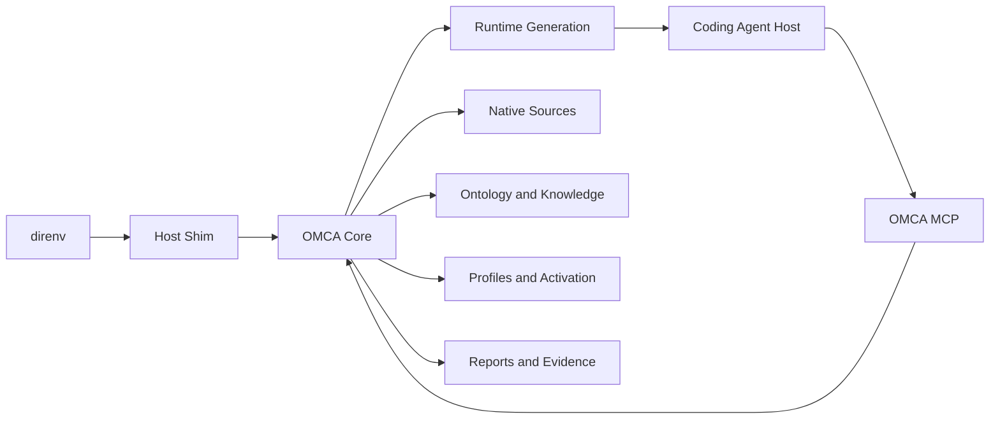

# Architecture

Status: draft

## 1. Architecture Goals

The architecture must absorb the combinatorial complexity of:

```text
identities × projects × hosts × versions × concepts × invocation contexts
```

without exposing that cross product as the daily user experience.

Machine work remains multiplicative. Human work is grouped by root cause:

```text
human review cost ≈ root causes + capability gaps + explicit exceptions
```

The system is a local compiler and evidence store, not a file synchronizer.

## 2. System Context



One `omca` executable provides the deterministic core and four frontends:

```text
omca CLI/TUI
omca env
host shims
omca mcp serve
```

The MCP server is the model-facing control interface. It calls the same core as
the CLI and TUI; it is not a second implementation and it is not responsible
for initial isolation.

## 3. Core Pipeline

```text
Detect Context
  -> Resolve Host and Knowledge Pack
  -> Observe Native and Runtime Sources
  -> Normalize Observations into the Ontology
  -> Build Observed, Effective, and Desired Graphs
  -> Classify and Group Drift
  -> Produce Report
  -> Accept Desired-state Change
  -> Compile Pending Generation
  -> Activate at Restart
  -> Verify and Record Evidence
```

`Plan`, `Apply`, and `Rollback` are internal Reconcile transactions. `Verify` is
evidence attached to results. `Enforce` is a guarantee classification attached
to policy outcomes.

## 4. Components

| Component | Responsibility |
|---|---|
| Context Detector | Resolve worktree, repository, identities, host, surface, cwd, trust, and explicit overrides. |
| Native Observer | Inventory known sources without executing discovered assets. |
| Knowledge Repository | Resolve immutable host/version facts and qualification state. |
| Normalizer | Project supported observations into canonical ontology entities. |
| Identity Matcher | Match physical representations to stable logical entities and preserve ambiguity. |
| Profile Resolver | Compose Profiles, Bindings, policy, exceptions, and local Activation. |
| Host Resolver | Compute expected host-effective state for an explicit invocation context. |
| Drift Engine | Compare graphs, derive root causes, and retain the full matrix. |
| Runtime Compiler | Render a complete immutable host generation from desired state. |
| Reconciler | Stage, validate, activate, and roll back generations transactionally. |
| Assurance Engine | Gather evidence and classify guarantee levels. |
| Artifact Store | Persist content-addressed manifests, reports, plans, and provenance. |
| MCP Server | Expose minimal read/query/proposal operations to an LLM. |
| TUI/CLI | Present human workflows, confirmation, restart, rollback, and Debug. |

## 5. Core Graphs

### 5.1 Observed Graph

Represents physical reality:

```text
host instance
source
scope
representation
trust
ownership
raw/parsed digest
provenance
opaque fields
```

### 5.2 Effective Graph

Represents what the host is expected or confirmed to load for one invocation:

```text
project × host × surface × version × concept × invocation context
```

The graph retains the resolver program, selected source, ignored sources,
constraints, and evidence.

### 5.3 Desired Graph

Represents the host-neutral result of Profiles, Bindings, local Activation,
policy, and exceptions. It contains no native host path.

### 5.4 Generation Graph

Maps Desired Graph entities to native artifacts in one immutable runtime. Every
edge contains Adapter ID, Knowledge digest, mapping relation, and ownership.

## 6. Planned Repository Layout

```text
.
├── cmd/omca/
├── internal/
│   ├── domain/                 # stable IDs, canonical types, invariants
│   ├── context/                # worktree and identity detection
│   ├── observe/                # source discovery and inventory
│   ├── ontology/               # schema loading and canonical validation
│   ├── knowledge/              # immutable packs and update candidates
│   ├── normalize/              # representation-to-ontology projection
│   ├── profiles/               # profiles, bindings, activation, exceptions
│   ├── resolve/                # desired and host-effective graphs
│   ├── drift/                  # assertions and root-cause grouping
│   ├── report/                 # human, JSON, TUI, and MCP projections
│   ├── runtime/                # bootstrap and generation compilation
│   ├── reconcile/              # stage, activate, ledger, rollback
│   ├── assurance/              # verification and guarantee classification
│   ├── artifact/               # content-addressed local store
│   ├── mcp/                    # minimal model-facing protocol
│   └── adapters/
│       ├── codex/
│       ├── claude/
│       └── opencode/
├── ontology/
│   ├── concepts/
│   ├── operators/
│   └── schemas/
├── knowledge/
│   ├── sources.yaml
│   └── hosts/<host>/<surface>/<version>/
├── schemas/
│   ├── config/
│   ├── domain/
│   └── protocol/
├── fixtures/<host>/<version>/<case>/
├── docs/
└── tests/
```

The first implementation should be a single cross-platform Go binary. The
problem is local filesystem discovery, deterministic graph construction,
schema validation, content-addressed artifacts, process launching, and
reproducible fixtures. A distributed service architecture is not justified.

## 7. User Configuration Layout

```text
~/.config/omca/
├── config.yaml
├── sources.yaml
├── profiles/
│   ├── personal/
│   ├── company/
│   ├── team/
│   └── task/
├── bindings/
├── policies/
├── exceptions/
└── assets/
```

Repository-shared configuration:

```text
<repository>/.omca/
├── project.yaml
├── profiles/
├── policies/
├── exceptions/
└── assets/
```

Personal identity selection and worktree activation are local state, not shared
repository configuration.

## 8. Runtime and State Layout

```text
~/.local/state/omca/
├── worktrees/<worktree-id>/
│   ├── desired/
│   │   ├── identities.yaml
│   │   ├── activation.yaml
│   │   └── local-overrides.yaml
│   ├── generations/<generation-id>/
│   │   ├── manifest.json
│   │   ├── report.json
│   │   ├── evidence.json
│   │   └── hosts/<host>/<surface>/
│   ├── current
│   ├── pending
│   └── ledger/
├── ownership/
└── backups/

~/.cache/omca/
├── knowledge/
├── observations/
└── compilation/
```

Persistent desired state and generation history live under XDG state. Derived,
re-creatable observations and compilation results live under XDG cache.

## 9. Core Interfaces

Host adapters own physical host semantics. They do not compose Profiles or
classify cross-host Drift.

```go
type HostAdapter interface {
    ID() AdapterID
    Detect(context.Context, DetectRequest) ([]HostInstance, error)
    Capabilities(context.Context, HostInstance) (CapabilityManifest, error)
    Observe(context.Context, ObserveRequest) (ObservationSet, error)
    Resolve(context.Context, ResolveRequest) (HostEffectiveState, error)
    Compile(context.Context, CompileRequest) (ArtifactSet, error)
    Verify(context.Context, VerifyRequest) (EvidenceSet, error)
    Launch(context.Context, LaunchRequest) error
}

type KnowledgeRepository interface {
    Resolve(context.Context, HostInstance) (KnowledgePack, error)
    Status(context.Context, KnowledgeQuery) ([]KnowledgeStatus, error)
    ProposeUpdate(context.Context, UpdateRequest) (KnowledgeCandidate, error)
}

type Normalizer interface {
    Normalize(context.Context, ObservationSet, KnowledgePack) (ObservedGraph, error)
}

type ProfileResolver interface {
    Resolve(context.Context, InvocationContext, []Profile) (DesiredGraph, error)
}

type DriftEngine interface {
    Compare(context.Context, DesiredGraph, EffectiveGraph) (DriftReport, error)
    Explain(context.Context, ExplainQuery) (Explanation, error)
}

type RuntimeCompiler interface {
    Bootstrap(context.Context, BootstrapRequest) (Generation, error)
    Compile(context.Context, CompileRequest) (Generation, error)
}

type Reconciler interface {
    Stage(context.Context, Generation) (PendingGeneration, error)
    Activate(context.Context, ActivateRequest) (LedgerEntry, error)
    Rollback(context.Context, RollbackRequest) (LedgerEntry, error)
}

type AssuranceEngine interface {
    Verify(context.Context, VerifyTarget) (EvidenceSet, error)
    ClassifyGuarantee(context.Context, PolicyOutcome) (GuaranteeLevel, error)
}
```

Every request that can affect output carries an explicit Invocation Context,
Adapter version, Knowledge digest, source fingerprint, and current generation
ID. No implementation reads a floating `latest` fact implicitly.

## 10. Ownership

```text
managed      OMCA owns the complete generated artifact
patched      OMCA owns specific fields in an external artifact
observed     OMCA reports but does not write
passthrough  OMCA parses around and preserves the native block
external     another authority owns the state
```

V1 prefers `managed` artifacts inside isolated generations and `observed`
native files. Persistent patching of native global files is outside the first
end-to-end path.

## 11. Related Documents

- [Runtime architecture](runtime.md)
- [Trusted reporting](reporting.md)
- [Ontology](../ontology/README.md)
- [Knowledge lifecycle](../knowledge/README.md)
- [Roadmap](../project/roadmap.md)
