# Coding Agent Harness Ontology

Status: draft v0.3

Evidence snapshot: 2026-07-16

Scope: Claude Code, Codex, OpenCode, Cursor, GitHub Copilot, Google
Antigravity CLI (`agy`), Pi, OpenClaw, and NousResearch Hermes Agent
(`hermess` alias).

This document defines the vendor-neutral vocabulary for `oh-my-code-agent`.
Although the product has a TUI, the managed targets include editor, CLI, cloud,
and gateway surfaces. The ontology is therefore named **Coding Agent Harness**,
not TUI ontology.

Host behavior changes quickly. A mapping is usable only when it records the
host version, evidence URL or source revision, physical source, scope, merge
operator, and confidence. `UNKNOWN` is safer than a guessed adapter.

This document defines canonical meaning and cross-host mappings. Versioned host
facts, evidence retention, and upgrade workflow belong to the
[Host Knowledge Lifecycle](../knowledge/README.md). Product defaults and runtime
behavior belong to the [Project Charter](../../init.md) and
[Runtime Architecture](../architecture/runtime.md).

## 1. Canonical Tree

```mermaid
flowchart TD
    H[Coding Agent Harness]
    H --> I[Identity and Context]
    H --> N[Instructions]
    H --> C[Capabilities]
    H --> T[Tools and Integrations]
    H --> P[Execution Policy]
    H --> L[Lifecycle]
    H --> R[Runtime and State]
    H --> D[Distribution]

    I --> I1[Host Installation]
    I --> I2[Workspace and Trust]
    I --> I3[Profile and Session]

    N --> N1[Base or System Prompt]
    N --> N2[Always-on Instructions]
    N --> N3[Path-scoped Rules]
    N --> N4[Task Prompts and Commands]
    N --> N5[Memory]

    C --> C1[Skill]
    C --> C2[Agent or Subagent]
    C --> C3[Plugin or Extension]

    T --> T1[Built-in Tool]
    T --> T2[MCP Server]
    T --> T3[Connector or App]
    T --> T4[LSP Browser Computer-use]

    P --> P1[Filesystem]
    P --> P2[Network]
    P --> P3[Tool and Shell Permission]
    P --> P4[Approval and Sandbox]
    P --> P5[Managed Constraints]

    L --> L1[Hooks and Middleware]
    L --> L2[Schedules and Background Tasks]
    L --> L3[Loops and Delegation]

    R --> R1[Model Provider Reasoning]
    R --> R2[Session History Cache]
    R --> R3[Credentials and Secrets]
    R --> R4[Effective Snapshot and Diagnostics]
    R --> R5[Runtime Generation]

    D --> D1[Built-in]
    D --> D2[Managed User Project]
    D --> D3[Package Marketplace]
    D --> D4[Knowledge Pack Version Update]
```



### 1.1 Core entities

| Entity | Meaning | Non-equivalence rule |
|---|---|---|
| `host` | One product installation and surface, such as `copilot:cli` | A brand is not a single host when CLI, editor, and cloud resolve differently. |
| `source` | A physical file, managed policy, CLI flag, environment value, or built-in default | A generated runtime view is output, not a source of truth. |
| `scope` | The subjects and locations affected by a source | Scope does not imply precedence. |
| `profile` | A composable set of desired assets, preferences, and constraints | A Profile is host-neutral intent, not a native host profile file. |
| `activation_intent` | `REQUIRED`, `DEFAULT`, `AVAILABLE`, or `DENIED` intent for one entity in a context | Activation intent selects desired state; it is not native host precedence. |
| `instruction` | Always-on or conditionally loaded behavioral context | Instructions guide the model; they do not enforce security. |
| `skill` | Discoverable, on-demand procedural context, normally with `SKILL.md` | A skill is not a plugin and not necessarily a slash command. |
| `agent` | A delegated role with its own prompt, model, context, and tool boundary | A profile that only changes preferences is not an agent. |
| `tool` | A callable operation visible to the model | A tool name is not a stable identity across transports. |
| `mcp_server` | An MCP transport endpoint exposing tools, resources, or prompts | A connector/app may use MCP internally but has different auth and governance. |
| `connector` | Account-authorized integration managed by a host or SaaS control plane | Do not merge it with a same-brand MCP server without duplicate detection. |
| `plugin` | A distribution container that may bundle several entity types | Plugin precedence belongs to each contained entity, not the package as a whole. |
| `policy` | Enforced allow, deny, approval, sandbox, trust, or managed constraint | Policy is evaluated by the client/runtime, not by model compliance. |
| `hook` | Deterministic callback bound to a lifecycle event | A hook may observe or mutate sensitive prompt/tool payloads. |
| `state` | Sessions, cache, trust decisions, credentials, and runtime metadata | State is inventory-only unless an operation explicitly manages it. |
| `binding` | Includes/excludes an entity for a context, profile, or agent | Binding resolves after source discovery and before host generation. |
| `effective_harness` | Immutable resolved view with provenance for one run | It must be reproducible and must never silently overwrite real global config. |
| `runtime_generation` | Immutable host artifacts compiled from one Desired Graph and Knowledge set | A generation is a build output, never a desired-state source. |

### 1.2 Classification vocabulary

Every host mapping uses one of these relations:

| Relation | Meaning |
|---|---|
| `EXACT` | Same core semantics and a documented physical mapping. |
| `PARTIAL` | Host supports part of the concept or needs an adapter translation. |
| `VENDOR_ONLY` | Important host feature with no portable equivalent. |
| `ABSENT` | No native facility in the examined version. |
| `UNKNOWN` | Current primary evidence does not establish behavior. Generation must fail closed or preserve it as an opaque vendor extension. |

## 2. Scope Model

Scopes form a graph, not a universal priority ladder.

| Canonical scope | Typical subject | Typical physical source |
|---|---|---|
| `builtin` | Everyone using a host version | Binary or bundled package |
| `managed` | Organization, fleet, or machine | Admin service, MDM, `/etc`, system policy |
| `user` | One OS user across workspaces | Home-directory config |
| `profile` | Explicitly selected isolated persona/configuration | Named config or alternate home |
| `workspace` | Repository or opened workspace | Committed project config |
| `worktree` | One Git checkout or directory runtime instance | Local Activation and immutable runtime state |
| `directory` | A subtree or matching path/glob | Nested instructions/rules |
| `local` | One user in one workspace | Gitignored project-local config |
| `session` | One invocation or conversation | CLI flags, environment, runtime UI |

Required scope fields:

```yaml
scope:
  kind: workspace
  root: /absolute/repository/root
  selector: "src/payments/**"
  shared: true
  trust_required: true
```

`profile` is orthogonal. Codex selects a profile and then layers project config;
Hermes changes `HERMES_HOME`; Claude Code has no equivalent native profile
layer. The resolver must not place all three on one guessed ladder.

## 3. Composition and Precedence

### 3.1 Merge operators

| Operator | Use |
|---|---|
| `REPLACE` | A higher source replaces a scalar or whole entity. |
| `DEEP_MERGE` | Objects merge recursively; leaf conflicts require an explicit winner. |
| `CONCAT_ORDERED` | Instruction texts are appended in a documented order. |
| `UNION_BY_ID` | Entities merge by canonical logical ID while retaining provenance. |
| `FIRST_MATCH` | The first existing or matching source wins and later candidates are ignored. |
| `NAMESPACE` | Duplicate names remain distinct through a package or directory prefix. |
| `DENY_WINS` | Any applicable deny blocks the action. |
| `MANAGED_GUARDRAIL` | Admin policy constrains the result rather than merely supplying a higher value. |
| `UNSPECIFIED` | Vendor does not define conflict resolution; surface a conflict. |

### 3.2 Resolution contract

There is no host-wide `last write wins` rule. Native effective state, desired
state, and generated runtime state are separate resolutions:

```text
Native:
discover native sources
  -> normalize entities and scopes
  -> apply host-specific merge operator per concept
  -> apply managed/trust/policy constraints
  -> detect duplicate logical capabilities
  -> emit native effective snapshot + provenance + unresolved conflicts

Desired:
select context and Profiles
  -> apply activation intent, policy, and exceptions
  -> emit host-neutral Desired Graph

Runtime:
Desired Graph + qualified Host Knowledge
  -> compile complete immutable generation
  -> restart host
  -> verify host-effective state
```

Examples:

- Claude Code settings use `REPLACE` by scope, while permission lists merge and
  denials constrain the result.
- Codex project configuration resolves root-to-current-directory, while
  `AGENTS.md` content is `CONCAT_ORDERED`.
- Hermes project context uses `FIRST_MATCH`; it does not concatenate
  `.hermes.md`, `AGENTS.md`, `CLAUDE.md`, and `.cursorrules`.
- Cursor explicitly warns against conflicting simultaneous rules but does not
  publish a general winner. The resolver must report `UNSPECIFIED`.

## 4. Host Registry

| Canonical ID | Accepted aliases | Surfaces in scope | Evidence state |
|---|---|---|---|
| `claude-code` | `claude` | CLI, editor integrations | documented |
| `codex` | `openai-codex` | CLI, app | documented |
| `opencode` | `open-code` | CLI, app | documented with duplicate-resolution gaps |
| `cursor` | `cursor-agent` | editor, CLI, cloud | documented with path gaps |
| `github-copilot` | `copilot`, `gh-copilot` | CLI, VS Code, GitHub.com | documented; surface split required |
| `antigravity-cli` | `agy`, `google-antigravity` | CLI with shared GUI engine | partial, version-pinned adapter required |
| `pi` | `pi-agent` | CLI | documented |
| `openclaw` | `claw` | gateway, CLI, embedded agents | documented |
| `hermes-agent` | `hermes`, `hermess` | CLI, gateway | source-verified |

Aliases are lookup conveniences only. An adapter must bind the detected binary
and version to a canonical ID before reading or writing anything.

Registry entries are knowledge targets, not support commitments. First-party
qualified adapter plugins exist for `claude-code` and `codex`; every other host
remains at the knowledge/observation tier until an adapter plugin qualifies it
per capability.

## 5. Cross-host Capability Map

Legend: `E` = `EXACT`, `P` = `PARTIAL`, `V` = `VENDOR_ONLY`, `-` = `ABSENT`,
`?` = `UNKNOWN`.

| Concept | Claude | Codex | OpenCode | Cursor | Copilot | Agy | Pi | OpenClaw | Hermes |
|---|---:|---:|---:|---:|---:|---:|---:|---:|---:|
| Always-on instructions | E | E | E | E | E | P | E | E | E |
| Path-scoped rules | E | E | P | E | E | ? | P | P | P |
| Skill | E | E | E | E | E | P | E | E | E |
| Custom agent/subagent | E | E | E | E | E | P | P | E | P |
| MCP client registry | E | E | E | E | E | E | P | E | E |
| Hook/lifecycle callback | E | E | P | E | E | E | P | E | E |
| Plugin/package | E | E | E | E | E | E | E | E | E |
| Enforced sandbox/permission | E | E | P | E | E | E | P | E | E |
| Native profile isolation | P | E | P | P | P | P | P | E | E |
| Automatic durable memory | E | P | ? | P | P | ? | P | E | E |
| Connector/app control plane | E | E | - | P | E | P | - | P | P |

`P` does not mean safe interchange. For example, Pi extensions can implement
MCP or hooks, but an extension runs code with the Pi process permissions and is
not equivalent to a declarative native registry.

## 6. Physical Mapping by Host

### 6.1 Claude Code

| Concept | Physical source and scope | Effective semantics |
|---|---|---|
| Settings | managed policy; `~/.claude/settings.json`; `.claude/settings.json`; `.claude/settings.local.json`; CLI | Scalars: managed > CLI > local > project > user. Permissions merge separately. |
| Instructions | managed `CLAUDE.md`; `~/.claude/CLAUDE.md` and `~/.claude/rules/`; project/ancestor `CLAUDE.md` or `.claude/CLAUDE.md`; `.claude/rules/`; `CLAUDE.local.md`; nested on-demand files | Ordered context. User rules load before project rules; conflicts are model guidance, not enforcement. Claude does not natively read `AGENTS.md`; import it from `CLAUDE.md`. |
| Skills | enterprise; `~/.claude/skills/<id>/SKILL.md`; `.claude/skills/<id>/SKILL.md`; nested skills; plugin skills; bundled | Same-name: enterprise > personal > project > bundled. Plugin skills are namespaced. Nested variants remain directory-qualified. |
| Agents | `~/.claude/agents/`; `.claude/agents/`; CLI `--agents` | User and project definitions; selected agent can change prompt, tools, and model. Record duplicate-name behavior per detected version. |
| MCP | managed MCP; user/local state in `~/.claude.json`; project `.mcp.json`; CLI `--mcp-config`; claude.ai connectors | Policy allow/deny constrains every source; deny takes precedence. Keep connectors distinct from local MCP definitions. |
| Hooks/plugins | `hooks` in scoped settings; plugin manifests and enabled-plugin settings | Hooks inherit settings scopes and trust. Managed policy can reject non-managed hooks or sideload flags. |
| Policy/state | settings permissions/sandbox/trust; OAuth, project trust, cache in `~/.claude.json`; memory under `~/.claude/projects/<project>/memory/` | `deny` and managed restrictions are enforcement; `CLAUDE.md` is guidance. Never export OAuth or state as portable config. |

Primary evidence: [settings](https://code.claude.com/docs/en/settings),
[memory and instructions](https://code.claude.com/docs/en/memory), and
[skills](https://code.claude.com/docs/en/skills).

### 6.2 OpenAI Codex

| Concept | Physical source and scope | Effective semantics |
|---|---|---|
| Settings | `/etc/codex/config.toml`; `$CODEX_HOME/config.toml`; selected `$CODEX_HOME/<profile>.config.toml`; trusted project `.codex/config.toml` from root to cwd; CLI and `-c` | Highest value layer: CLI > nearest project > ancestor project > profile > user > system > default. Managed `requirements.toml` is a guardrail, not an ordinary lower layer. |
| Instructions | `$CODEX_HOME/AGENTS.override.md` else `AGENTS.md`; from project root to cwd, each directory uses override then `AGENTS.md` then configured fallback names | Global then root-to-cwd `CONCAT_ORDERED`; closer instructions appear later. Files above project root are not project instructions. |
| Skills | repo `.agents/skills` discovered from cwd/ancestors/root; `$HOME/.agents/skills`; `/etc/codex/skills`; bundled; extra configured paths | Duplicate names are not assumed to override or merge; preserve both discovered sources unless the versioned adapter proves otherwise. Config can disable a skill by path. |
| Agents | `[agents.<id>]` and referenced agent config files in `config.toml`; plugin-provided agents | Role definition can select model, instructions, tools, and limits. Resolve the referenced file relative to its declaring source. |
| MCP | `[mcp_servers.<id>]` in user or trusted project config; CLI overrides | Merge by server ID following config precedence, then apply managed allowlists and trust. |
| Hooks/plugins | scoped `hooks.json`/hook config; `.codex-plugin/plugin.json` packages | Hooks can observe prompt and tool inputs. Plugin contents retain their entity type and provenance. |
| Policy/state | `approval_policy`, `sandbox_mode`, filesystem/network policy, trusted projects; `$CODEX_HOME` auth/logs/sessions | Managed requirements constrain allowed values. Credentials and sessions are state, never profile payloads. |

Primary evidence: [Codex CLI](https://learn.chatgpt.com/docs/codex/cli),
[configuration](https://learn.chatgpt.com/docs/config-file/config-basic),
[AGENTS.md](https://learn.chatgpt.com/docs/agent-configuration/agents-md), and
[skills](https://learn.chatgpt.com/docs/build-skills).

### 6.3 OpenCode

| Concept | Physical source and scope | Effective semantics |
|---|---|---|
| Settings | managed configuration; organization `.well-known/opencode`; global `~/.config/opencode/opencode.json`; `OPENCODE_CONFIG`; project `opencode.json`; `.opencode` roots; inline `OPENCODE_CONFIG_CONTENT` | Configuration sources merge. Later sources override conflicting values, while managed configuration remains an immutable constraint. Bind this order to the detected version. |
| Instructions | project/ancestor `AGENTS.md` with `CLAUDE.md` fallback; global `~/.config/opencode/AGENTS.md` with `~/.claude/CLAUDE.md` fallback; config `instructions` entries | The first matching file wins inside each fallback category. Configured instruction files compose with the selected AGENTS context; contradictory text remains advisory. |
| Skills | project and ancestor `.opencode/skills`, `.agents/skills`, `.claude/skills`; matching global roots | Discovery locations are native. Same-name duplicate behavior remains `UNKNOWN` until a versioned fixture proves the scan order. |
| Agents | Markdown agent definitions under project/global `.opencode/agents`; agents in configuration | Agent-specific tools, model, prompt and permissions override or constrain global defaults according to their field semantics. |
| MCP | `mcp` definitions in merged OpenCode configuration | Definitions follow configuration source merging by ID. Unknown same-ID behavior or transport fields block destructive generation. |
| Hooks/plugins | JavaScript/TypeScript plugins under project/global `.opencode/plugins` and configured packages | Plugins are executable code with lifecycle access, not portable declarative hooks. Inventory and trust reporting precede any activation. |
| Policy/state | permission rules, enabled/disabled providers, trust and application state | The last matching permission pattern determines the result; disabled providers take precedence over enabled providers. State and credentials are not Profile payloads. |

Primary evidence: [configuration](https://opencode.ai/docs/config/),
[rules](https://opencode.ai/docs/rules),
[skills](https://opencode.ai/docs/skills/), and
[agents](https://opencode.ai/docs/agents/).

### 6.4 Cursor

| Concept | Physical source and scope | Effective semantics |
|---|---|---|
| Instructions | User Rules in settings; `.cursor/rules/*.mdc` including nested directories; root `AGENTS.md` and `CLAUDE.md`; legacy `.cursorrules` | Rules can be always, glob-attached, agent-requested, or manual. Applicable rules compose; official docs do not define a universal conflict winner. |
| Skills | `SKILL.md` is native in editor and CLI | `UNKNOWN`: current official changelog establishes the entity but not a stable complete path/duplicate-precedence contract. Adapter discovery must be version-probed before generation. |
| Agents | built-in and custom subagents in editor/CLI; plugin-provided subagents | Prompt, tool, and model isolation are native. Definition path and same-name rules are version-probed adapter facts. |
| MCP | project `.cursor/mcp.json`; user `~/.cursor/mcp.json`; newer lazy JSON definitions under `.cursor` | Both scopes are native. Same-name precedence is `UNKNOWN` unless the detected version exposes it. |
| Hooks/plugins | `.cursor/hooks.json`; team/MDM hooks; marketplace plugins | Plugins bundle skills, subagents, MCP, hooks, and rules. Claude-hook compatibility does not imply identical event payloads. |
| Policy/state | editor/CLI permission modes; sandbox and `sandbox.json`; enterprise policies | Enterprise network/file controls constrain user policy. `Run Everything` must remain an explicit high-risk session state. |

Primary evidence: [Cursor 2.4 agent harness changes](https://cursor.com/changelog/2-4),
[Cursor 2.5 plugins and sandbox controls](https://cursor.com/changelog/2-5), and
[Cursor documentation](https://cursor.com/docs).

### 6.5 GitHub Copilot

Copilot must be modeled as separate `cli`, `vscode`, and `github.com` surfaces.
The table below is CLI-first; editor/cloud policy is attached as a separate
source, never silently folded into CLI precedence.

| Concept | Physical source and scope | Effective semantics |
|---|---|---|
| CLI home | `$COPILOT_HOME` or `~/.copilot/`: `settings.json`, `copilot-instructions.md`, `instructions/`, `mcp-config.json`, `agents/`, `skills/`, `hooks/` | One user config root; project sources below are layered by concept. |
| Instructions | personal home instructions; repository `.github/copilot-instructions.md`; `AGENTS.md`, `CLAUDE.md`, `GEMINI.md`; `.github/instructions/**/*.instructions.md`; extra directories | CLI combines applicable non-identical instructions and does not publish a general file winner. VS Code/GitHub.com have separate personal/repository/org semantics. |
| Skills | project `.github/skills`, `.agents/skills`, `.claude/skills`; ancestor project sources; personal `~/.copilot/skills`, `~/.agents/skills`; plugin/bundled | Duplicate lookup is ordered and first found wins in the current CLI. Preserve the exact search trace. |
| Agents | project `.github/agents/*.agent.md`; personal `~/.copilot/agents/*.agent.md`; plugin agents | Project agent wins over a same-named personal agent. |
| MCP | session `--additional-mcp-config`; plugin; workspace `.mcp.json`/`.github/mcp.json` walking cwd to root; user `~/.copilot/mcp-config.json` | Highest: session > plugin > nearest workspace chain > user, then enterprise allowlist. |
| Hooks/plugins | repo `.github/hooks/*.json`; user `~/.copilot/hooks/*.json`; inline user settings; plugins/extensions | Repo and user hooks can both run. Treat all hook payload collection as auditable data flow. |
| Policy/state | enterprise policy; CLI permissions/settings; per-project decisions in `~/.copilot/permissions-config.json`; authentication state | Enterprise constraints enclose local settings. Stored grants are state and must not be copied into team profiles. |

Primary evidence: [CLI config directory](https://docs.github.com/en/copilot/reference/copilot-cli-reference/cli-config-dir-reference),
[CLI custom instructions](https://docs.github.com/en/copilot/how-tos/copilot-cli/customize-copilot/add-custom-instructions),
[CLI skills](https://docs.github.com/en/copilot/how-tos/copilot-cli/customize-copilot/add-skills),
and [hooks](https://docs.github.com/en/copilot/how-tos/copilot-cli/customize-copilot/use-hooks).

### 6.6 Google Antigravity CLI (`agy`)

This adapter is deliberately `PARTIAL`. The official CLI repository currently
ships a binary-oriented README/changelog rather than a complete configuration
reference. Facts below must be pinned to the detected `agy` version.

| Concept | Physical source and scope | Effective semantics |
|---|---|---|
| Settings | global CLI `~/.gemini/antigravity-cli/settings.json`; shared Antigravity root `~/.gemini/config/`; project permission records under `~/.gemini/config/projects/` | Project-specific permissions take precedence over global CLI settings. GUI and CLI share parts of the agent engine and configuration. |
| Instructions/skills | customization manager loads rules, skills, and agents from shared and workspace roots | Exact filenames, discovery roots, and duplicate rules are `UNKNOWN` in current public reference. Inventory may display them; generation must wait for version fixtures. |
| Agents | Markdown agent definitions under shared customization storage; plugin agents | Native but version-sensitive; retain opaque fields. |
| MCP | `~/.gemini/config/mcp_config.json`; workspace/project support is version-sensitive | Global registry is documented by release history. Same-name merge rules are `UNKNOWN`. |
| Hooks | global `~/.gemini/config/hooks.json`; workspace `<workspace>/.agents/hooks.json` | Workspace and global hooks exist; event and conflict semantics require version probes. |
| Plugins/policy/state | plugins install into shared `~/.gemini/config/`; permission modes in settings/CLI; authentication in system keyring | Never read keyring secrets. Project permission configuration overrides global permission defaults. |

Primary evidence: official
[Antigravity CLI repository](https://github.com/google-antigravity/antigravity-cli),
and
[changelog](https://github.com/google-antigravity/antigravity-cli/blob/main/CHANGELOG.md).

### 6.7 Pi

| Concept | Physical source and scope | Effective semantics |
|---|---|---|
| Settings | `~/.pi/agent/settings.json`; trusted project `.pi/settings.json`; CLI flags | Project settings deep-merge over global. Explicit CLI resource flags are invocation-specific. |
| Instructions | `~/.pi/agent/AGENTS.md`; ancestor/current `AGENTS.md` or `CLAUDE.md`; project `.pi/SYSTEM.md` then global `~/.pi/agent/SYSTEM.md`; corresponding `APPEND_SYSTEM.md` | System file replaces base prompt; append file appends. Context files load by discovery, but contradictory text has no enforcement precedence. |
| Skills | `~/.pi/agent/skills`, `~/.agents/skills`; trusted project/ancestor `.pi/skills`, `.agents/skills`; packages; settings and CLI resources | `--no-skills` disables discovery, not explicitly supplied skills. Duplicate-name resolution is `UNKNOWN` until source/version proof. |
| Extensions | `~/.pi/agent/extensions`; trusted project `.pi/extensions`; packages; CLI `-e` | Native code extension point for tools, commands, UI, and lifecycle events. Extensions run with the Pi process permissions. |
| Agents/MCP/hooks | implemented through extensions/packages rather than stable core declarative entities | `PARTIAL`; do not translate a native MCP or agent definition into arbitrary extension code automatically. |
| Policy/state | trust in `~/.pi/agent/trust.json`; approval flags; sessions/provider state in Pi home | Project resources require trust, but context files may be read before trust. This is a security-relevant exception. |

Primary evidence: [settings](https://pi.dev/docs/latest/settings),
[usage and context](https://pi.dev/docs/latest/usage),
[skills](https://pi.dev/docs/latest/skills), and
[extensions](https://pi.dev/docs/latest/extensions).

### 6.8 OpenClaw

| Concept | Physical source and scope | Effective semantics |
|---|---|---|
| Main config | `~/.openclaw/openclaw.json` JSON5 or `OPENCLAW_CONFIG_PATH`; optional `$include` fragments | One strict schema tree. Invalid config prevents Gateway startup. Includes are composition sources and must preserve path/provenance. |
| Agent/workspace | `agents.defaults`, `agents.list[]`; each agent workspace contains bootstrap, identity, memory, tools, and skill files | `agents.list[].skills` replaces inherited default skill allowlist; empty means none. Each agent has separate sessions/workspace. |
| Instructions/memory | workspace bootstrap files such as `AGENTS.md`, `SOUL.md`, `TOOLS.md`, `IDENTITY.md`, `USER.md`, `HEARTBEAT.md`, `MEMORY.md`, and daily `memory/` | Files occupy distinct prompt/memory roles; do not flatten them into one instruction blob. |
| Skills | `<workspace>/skills`; `<workspace>/.agents/skills`; `~/.agents/skills`; `~/.openclaw/skills`; bundled; `skills.load.extraDirs` and plugin skills | Same-name precedence is exactly the listed order, highest to lowest. Extra/plugin roots are lowest. |
| MCP | `mcp.servers` in main config; `openclaw mcp` registry; `openclaw mcp serve` exposes OpenClaw outward | Inbound and outbound MCP are distinct directions. `mcporter` is a separate registry and must not be merged implicitly. |
| Hooks/plugins | hook/plugin settings and `openclaw.plugin.json`; installed plugin skills/tools | Plugin contents merge at their entity-specific precedence. Third-party skills/plugins are executable trust boundaries. |
| Policy/state | per-agent sandbox/tools/exec/network controls; secret refs; `~/.openclaw/agents/<id>/sessions/*.jsonl` | Agent allowlists and sandbox constraints are enforced config; workspace instructions are guidance. Session transcripts are state. |

Primary evidence: [configuration](https://docs.openclaw.ai/gateway/configuration),
[agent runtime](https://docs.openclaw.ai/agent),
[skills and precedence](https://docs.openclaw.ai/skills), and
[MCP](https://docs.openclaw.ai/cli/mcp).

### 6.9 NousResearch Hermes Agent (`hermess`)

Current mappings were verified against the official repository source revision,
not inferred from compatibility filenames.

| Concept | Physical source and scope | Effective semantics |
|---|---|---|
| Home/profile | `HERMES_HOME`, default `~/.hermes`; profiles under `~/.hermes/profiles/<name>/` act as isolated Hermes homes | Selecting a profile changes config, identity, skills, memory, sessions, and tool state together. This is isolation, not a higher-precedence leaf layer. |
| Settings | `$HERMES_HOME/config.yaml`; `$HERMES_HOME/.env`; CLI `--model`/`--provider` and other invocation flags | Environment-backed values override config; explicit CLI model/provider override config. Precedence is field-specific. |
| Instructions | `$HERMES_HOME/SOUL.md`; project context candidate order: `.hermes.md`/`HERMES.md` walking to git root, then cwd `AGENTS.md`, then cwd `CLAUDE.md`, then cwd `.cursorrules`/`.cursor/rules/*.mdc` | `SOUL.md` is independent identity. Project context is `FIRST_MATCH`: only the first matching context type is loaded. Cursor rule files within the final candidate are sorted and concatenated. |
| Skills | `$HERMES_HOME/skills/<id>/SKILL.md`; `skills.external_dirs` in config | Local Hermes skill wins over same-named external skill; external directories are read-only discovery sources. |
| MCP | `mcp_servers` in `$HERMES_HOME/config.yaml` | Native stdio/HTTP registry. Profile selection isolates the entire registry. |
| Hooks/plugins | `hooks` in config; consent in `$HERMES_HOME/shell-hooks-allowlist.json`; Python middleware/plugins | Each event/command requires consent unless explicitly auto-accepted. Hooks can block tool calls or inject model context. |
| Agents/state | subagent/orchestration settings, profiles, memory/session/tool state under `HERMES_HOME` | Profiles are stronger isolation than lightweight roles; preserve that distinction during translation. |

Primary evidence: official [Hermes Agent repository](https://github.com/NousResearch/hermes-agent),
[configuration example](https://github.com/NousResearch/hermes-agent/blob/main/cli-config.yaml.example),
and current source for
[prompt/context resolution](https://github.com/NousResearch/hermes-agent/blob/main/agent/prompt_builder.py).

## 7. Adapter Record Contract

Every discovered source should normalize to a record shaped like this. A
numeric rank is insufficient because different concepts use different merge
operators and constraints:

```yaml
host:
  id: codex
  version: 0.144.5
surface: cli
knowledge:
  id: codex:cli:0.144
  digest: sha256:...
concept: instruction
source:
  kind: file
  path: /repo/AGENTS.md
scope:
  kind: workspace
  root: /repo
precedence:
  operator: CONCAT_ORDERED
  program: codex.instructions.root-to-cwd
  order: 3
  explanation: project-root instructions precede nested instructions
trust:
  required: true
evidence:
  relation: EXACT
  source: official-doc
  observed_at: 2026-07-16
  level: E2
capability:
  discover: EXACT
  parse: EXACT
  resolve: EXACT
  compile: PARTIAL
  verify: PARTIAL
  reconcile_mode: PATCHED
  verification_methods: [static-resolver]
  guarantee: ADVISORY
content_hash: sha256:...
opaque_vendor_fields: {}
```

Minimum adapter operations:

1. `detect`: binary, version, surface, home roots, workspace, and trust state.
2. `capabilities`: resolve the immutable Knowledge Pack and supported operations.
3. `observe`: inventory sources and state without mutation or execution.
4. `resolve`: compute host-effective values for an explicit invocation context.
5. `compile`: produce isolated or ownership-bounded artifacts only for proven mappings.
6. `verify`: return evidence without overstating advisory behavior as enforcement.
7. `launch`: use a generated runtime view through the least invasive supported mechanism.

Cross-host normalization, Profile composition, Drift grouping, Plan/Apply,
rollback, and reporting belong to the control plane rather than an Adapter.

## 8. Safety Invariants

- Managed security constraints are never downgraded into model instructions.
- A repository is untrusted until the host says otherwise; discovery does not
  authorize hook, extension, MCP, or shell execution.
- Hooks are data processors. Inventory must report event, command/URL, prompt
  or tool fields observed, redaction, destination, and retention if known.
- Credentials, OAuth tokens, keyring values, session transcripts, and saved
  approvals are state. Profiles store secret references only.
- Same-brand connector, MCP server, plugin tool, and built-in tool are separate
  sources. Duplicate logical capabilities must be shown before launch.
- `UNKNOWN` precedence blocks destructive generation. It does not block
  read-only inventory or preservation as an opaque vendor extension.
- Real global configuration is an observation source, not an implicit parent or
  build target for an isolated runtime.
- A minimal bootstrap generation establishes isolation before the target host
  loads the OMCA MCP server.
- MCP may update desired state or stage a pending generation, but it never
  mutates the active generation.
- Generated host views live in immutable generations and are activated only at
  a restart boundary through a reversible mechanism.

## 9. Open Questions for v0.4

1. Pin adapter fixtures and golden effective-config tests for each supported
   host version.
2. Resolve Cursor skill/agent discovery paths and duplicate-name behavior from
   an official schema or executable fixture.
3. Resolve Antigravity rules/skills/agents roots and all same-name precedence
   rules for a pinned `agy` release.
4. Prove Pi duplicate skill behavior and decide whether known MCP extensions
   deserve a named adapter capability rather than `PARTIAL` core support.
5. Prove OpenCode duplicate Skill and same-ID MCP behavior for pinned releases.
6. Model Copilot editor/cloud enterprise policy separately from Copilot CLI.
7. Define logical tool fingerprints for duplicate detection across built-in,
   MCP, connector/app, and plugin sources.
8. Add a policy lattice that can prove `deny`, managed allowlists, filesystem,
   network, approval, and sandbox outcomes without invoking an LLM.

## 10. Source Policy

Host mappings use primary vendor documentation or official source repositories.
The evidence date is part of this document because configuration contracts are
not temporally stable. Community posts may help discovery but cannot promote a
mapping from `UNKNOWN` to generated configuration. A runtime probe may do so
only when its host version and fixture output are stored with the adapter test.
Publication, staleness, retention, and upgrade rules are defined in the
[Host Knowledge Lifecycle](../knowledge/README.md).
